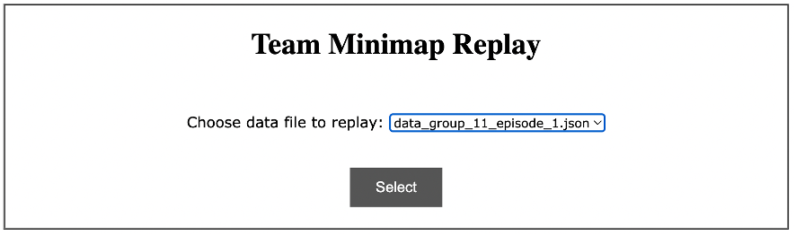
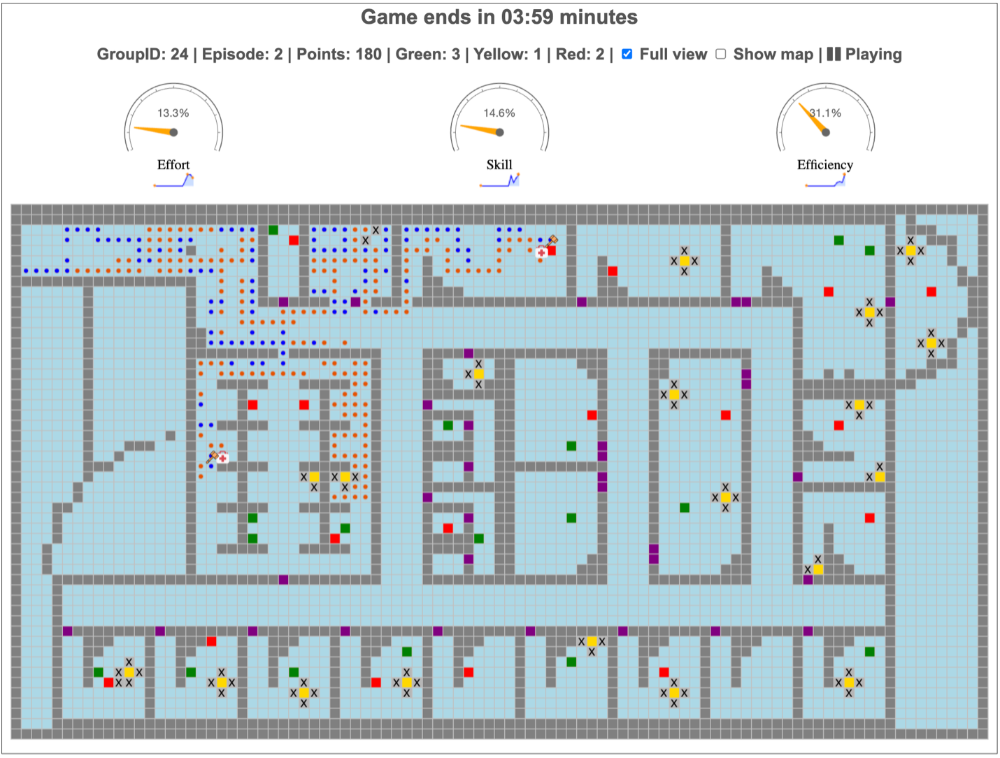

# Team Minimap Replay
This is a component developed to replay the Team Minimap game given a selected data file. The folder contains the data files should be indicated in the `demo-folder` property of the file  `mission/config.json`. 

The replay also allows to manually “Pause” and “Play” the replay visualization by clicking on the toggle button “Playing/Pausing”

## Requirements:
- To run locally:
    - Python 3.7+ installed
    - A Web browser

## Local Installation
1. In a command shell, goto the main folder of the cloned git repository which contains the `requirements.txt` file.
2. (suggestion) Create a virtual Python Environment by running the following commands in your shell. (This may be different on your machine!  If it does not work, look at how to install a virtual python env based on your system.):
    - `python3 -m venv env`
    - `source env/bin/activate`
3. Install the required python libraries by running this command in your shell:
    - `pip install -r requirements.txt`

## Local run
[http://0.0.0.0:5702/vis](http://0.0.0.0:5702/vis)

## Contact Info
Ngoc Nguyen\
ngocnt@cmu.edu